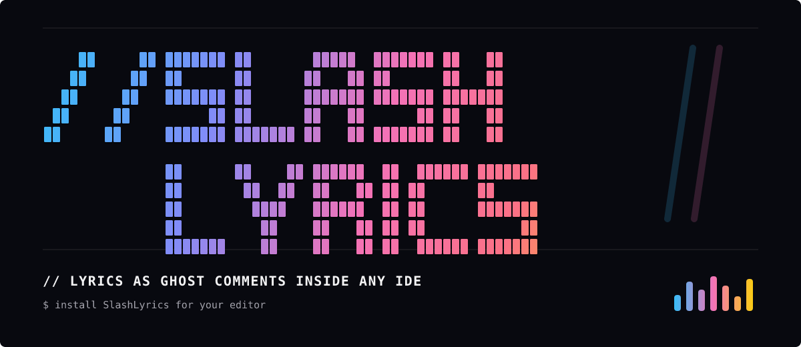

<p align="center">
  
</p>

<p align="center">
  <strong>Time-synced lyrics as ghost comments inside VS Code.</strong>
</p>

<p align="center">
  <a href="https://github.com/Cypherrr0/SlashLyrics/releases/latest"></a>
  
  
  <a href="LICENSE"></a>
</p>

SlashLyrics listens to the music already playing on your Mac and renders the current lyric as a faded `//`-style ghost comment in your editor. The lyric is visual only and never edits your files.

## Install

Download the latest release package and install it locally:

```bash
code --install-extension slashlyrics-0.1.2.vsix
```

Release asset: [slashlyrics-0.1.2.vsix](https://github.com/Cypherrr0/SlashLyrics/releases/download/v0.1.2/slashlyrics-0.1.2.vsix)

## What It Does

- Shows the current lyric as a ghost comment near your cursor or a fixed editor line.
- Reads system-wide Now Playing data from macOS media controls.
- Fetches time-synced LRC lyrics from NetEase Music and QQ Music.
- Keeps the source file clean by rendering lyrics outside the document text.
- Shows the active track in the editor status surface when supported.
- Caches lyrics locally for faster repeat playback.

## Usage

1. Install the extension.
2. Play music in any macOS player that appears in Control Center.
3. Open a file in your IDE and keep editing.
4. Lyrics appear as muted inline text without changing the document.

## Commands

| Command | Description |
|---|---|
| `SlashLyrics: Toggle` | Enable or disable lyrics display. |
| `SlashLyrics: Search Lyrics` | Search lyrics for the current track. |
| `SlashLyrics: Clear Cache` | Remove cached lyrics. |

## Settings

| Setting | Default | Description |
|---|---:|---|
| `slashlyrics.enabled` | `true` | Enable or disable SlashLyrics. |
| `slashlyrics.displayMode` | `cursor-line` | Show lyrics on the cursor line, top line, or a fixed line. |
| `slashlyrics.color` | `#6b7280` | Lyric decoration color. |
| `slashlyrics.showColor` | `true` | Use the configured lyric decoration color. |
| `slashlyrics.prefix` | `♪ ` | Prefix before each lyric. |
| `slashlyrics.showTranslation` | `false` | Show translated lyrics alongside the original line. |
| `slashlyrics.translationSeparator` | ` &#124; ` | Separator between original and translated lyrics. |
| `slashlyrics.providers` | `["netease", "qq"]` | Lyrics provider priority. |
| `slashlyrics.pollInterval` | `1000` | Polling interval in milliseconds while music is playing. |
| `slashlyrics.pauseOnBlur` | `false` | Pause polling when the editor loses focus. |

## Local Development

Install dependencies:

```bash
npm install
```

Run the unit tests:

```bash
npm test
```

Build the extension bundle:

```bash
npm run package
```

## Requirements

- macOS.
- VS Code 1.74 or later.
- A music player that integrates with macOS media controls, such as Spotify, Apple Music, NetEase Cloud Music, QQ Music, or a browser player that appears in Control Center.

Windows and Linux support are planned.

## License

[MIT](LICENSE)
